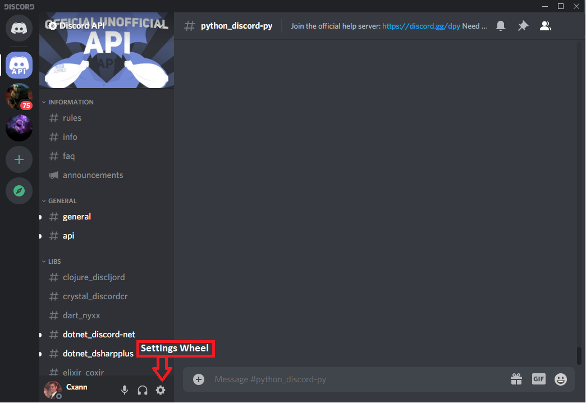
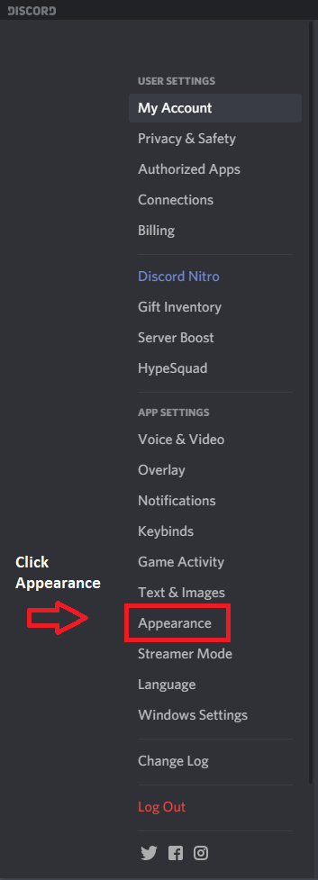
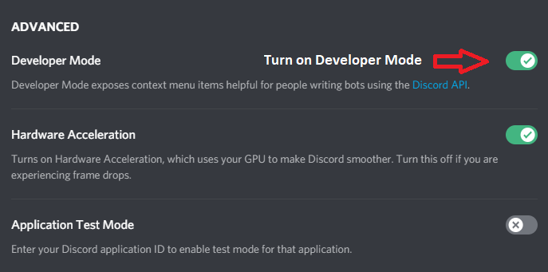
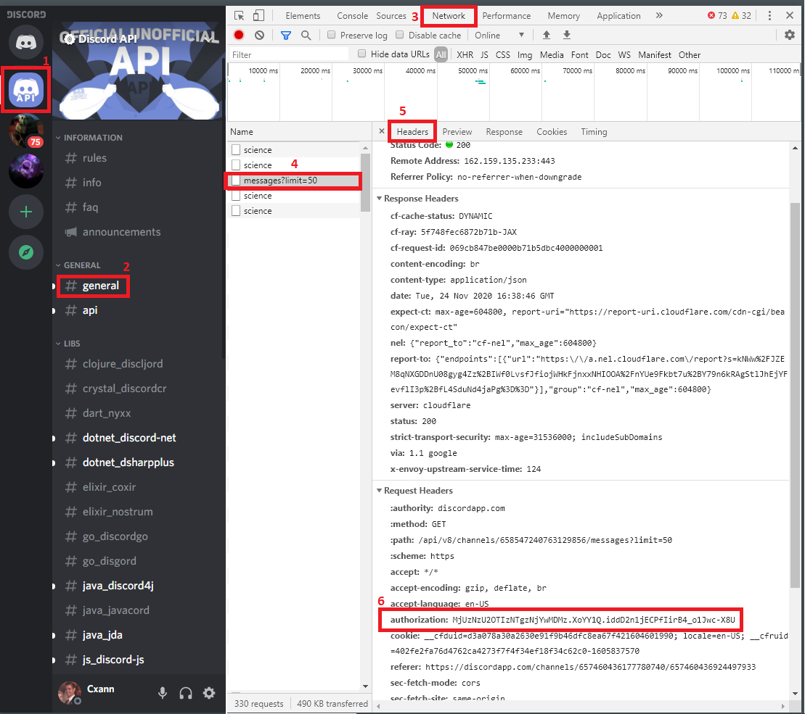
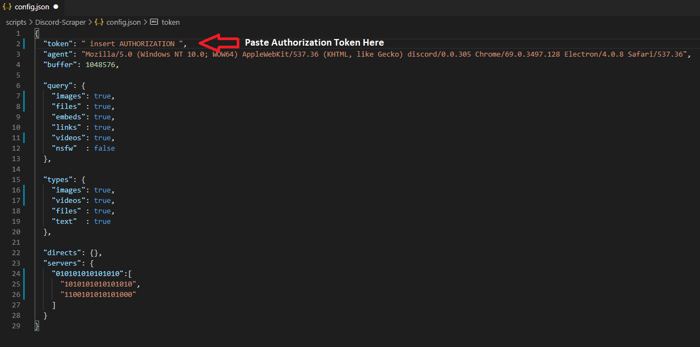
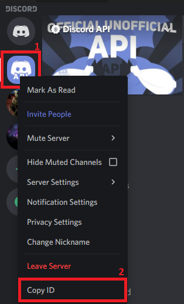
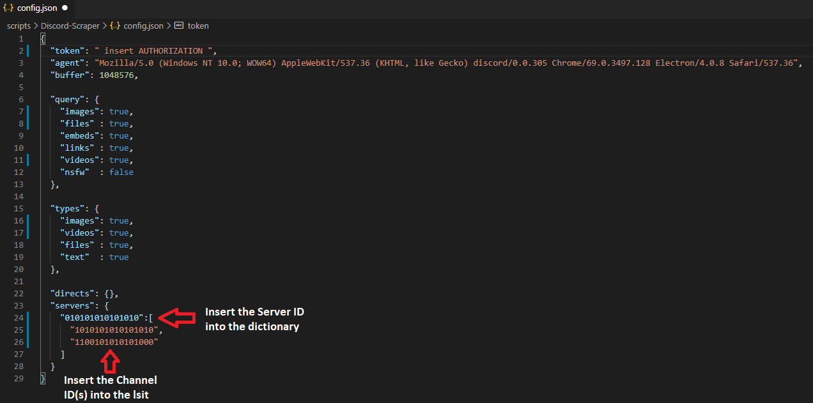
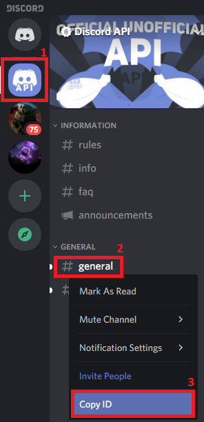

# Discord Scraper

## Table of Contents
* [Configuring Discord application for PC](#desktop-application)
* [Configuring Discord website for PC](#website)
* [Notes](#notes)
* [Changelog](#changelog)

## Configuring

### Desktop Application:

Step 1:
Open your Discord app and enter the app settings.

Step 2:
Traverse to Appearance and enable Developer Mode.

### Website:

Step 3:
Close the app settings and press CTRL + SHIFT + I to open the Developer panel.

Step 4:
Go to the Network tab and select from any personal message or server in your list.
Copy the value of "authorization" into the config.json file.

Step 5:
Close the Developer panel and right-click on the server icon and copy ID.
Paste the server ID into the config.json file.

Step 6:
Right-click on the channel name and copy ID.
Paste the channel ID into the config.json file.

Step 7:
Run the script to start the downloading process.

## Notes

* You can copy in multiple channels on multiple servers if you want to.
* You must make modifications to the JSON file before running the script (otherwise you'll end up with errors).

## Changelog

**The dates below are in DD-MM-YYYY formatting.**

20-11-2019 - Experimental Overhaul:
* Resurrected the experimental branch again for some testing.
* Created a separate module for this script (SimpleRequests).
* Added buffer size option in the JSON file (defaults to 1 MiB).
* Merged and removed experimental branch yet again.

18-06-2019 - Maintenance Update:
* Updated the README to update the token gathering method.
* Updated the README to remove unnecessary image use.
* Added personal/direct message channel option in JSON file.
* Removed page count option from the JSON file.
* Updated the wiki for this repository.

29-01-2019 - Overhaul:
* Merged Python 2 and Python 3 functionality into a single file.
* Removed the experimental branch since it is no longer needed.
* Added functionality to download text data and links.
* Added ability to set number of pages to grab (each page nets approximately 25 images).

13-11-2018 - Released:
* Implemented a new concept from the experimental branch.
* Updated the experimental branch to match the master branch.
* I will find a method of alleviating the duplicate images/videos issue.
* I will fix up the commenting and make the code easier on the eyes.

28-08-2018 - Added Experimental Branch:
* Python 3 version of script now uses a separate config.
* MFA token now goes in the separate config to help avoid accidental leakage of one's MFA token.
* Multiple channel and server support added.
* Replaced the requests module with http.client module which is built-in to Python 3.7.

07-04-2018 - Beta Fix #3:
* Fixed threading issue (too many concurrent threads)
* Fixed filename issues when grabbing files with similar filenames (still a potential issue with large amounts of files but significantly less issues)

07-04-2018 - Beta Fix #2:
* Fixed problems when downloading from channels with less than 25 images/videos as the older scripts assumed more than 25 images/videos in the channel.
* I will incorporate a better method of grabbing images where there's less corruptions and less missing photos.

21-02-2018 - Beta Update #1:
* Updated this readme to include warning information
* Created a version for those running Python 3
* Updated the Python 2 version to match the Python 3 version with threading support

03-10-2017 - Beta Fix #1:
* Fixed issue with URL appending offset query information ad infinitum.
* Fixed issue with uninitialized opener data when grabbing multiple pages of JSON data.
* Added new function to allow for the resetting of opener data when grabbing JSON data.

03-10-2017 - Beta Release:
* The first release of the script.
* Not meant for production use.
* Still has bugs to fix and features to implement.
