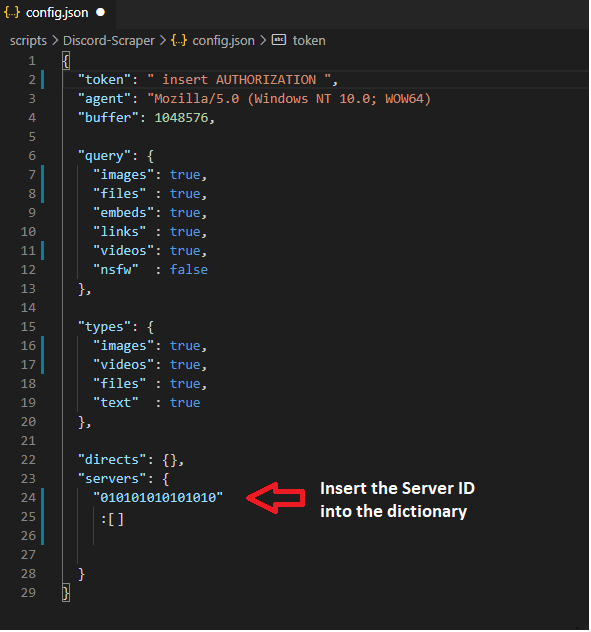
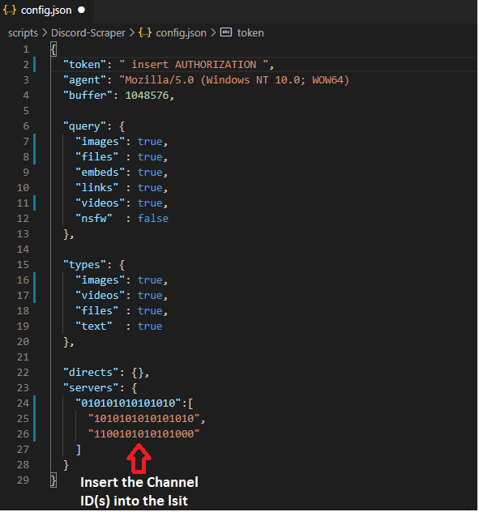

# Discord Scraper

## Table of Contents
* [Configuring Discord application for PC](#desktop-application)
* [Notes](#notes)

## Configuring:

Step 1:
Open your Discord app and click the settings wheel.

Step 2:
Find and Click 'Appearance' and enable Developer Mode.

Developer Mode is located at the very bottom of the appearance page, within the "Advanced" category.

### Authorization:

Step 3:
Close the settings menu and press CTRL + SHIFT + I to open the Developer panel (similiar to your browser).

Step 4:
Click on the server you want to scrape, then click any channel.

Go to the Network tab, click 'messages?limit=50' (or something similar) within the name list.

Click the header tab, and copy the value of "authorization" into the config.json file.

Paste the value you copied from the authorization field into the config.json into the variable "token".

Step 5:
Close the Developer panel and right-click on the server you plan to scrape and copy ID.

Paste the server ID into the config.json file in the dictionary 'servers'.

Step 6:
Right-click on a channel within the server you want to scrape and copy ID.

Paste the channel ID into the config.json file.

Step 7:
Run the script to start the downloading process.

## Notes

* You can copy in multiple channels on multiple servers if you want to.
* You must make modifications to the JSON file before running the script (otherwise you'll end up with errors).
